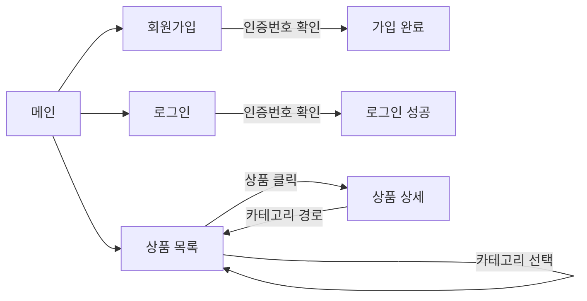
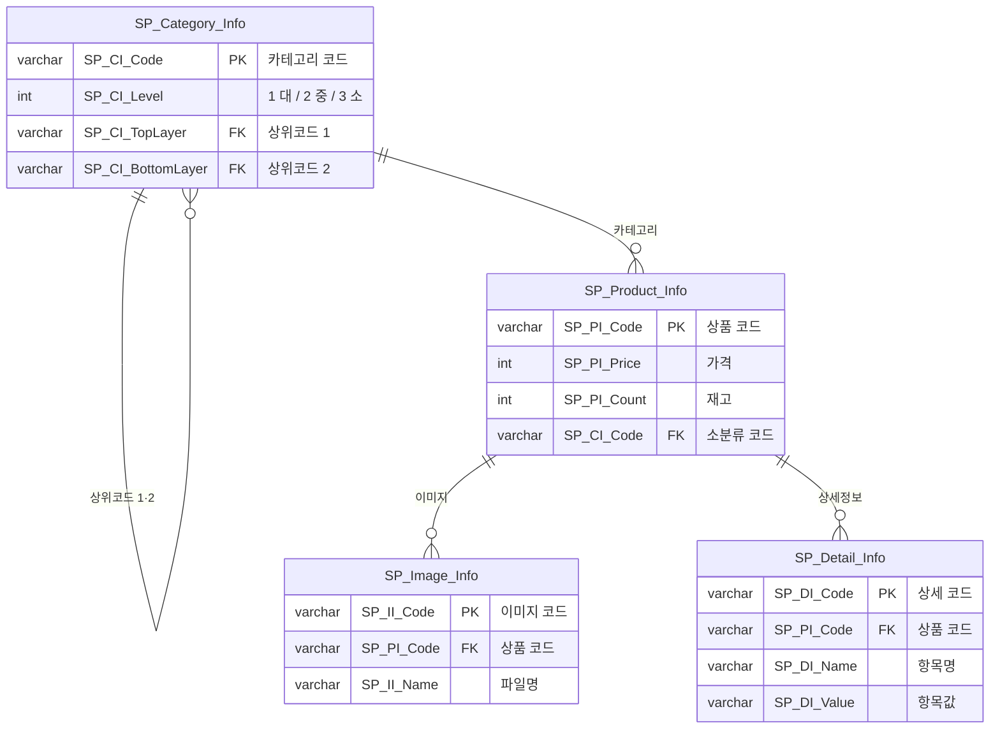
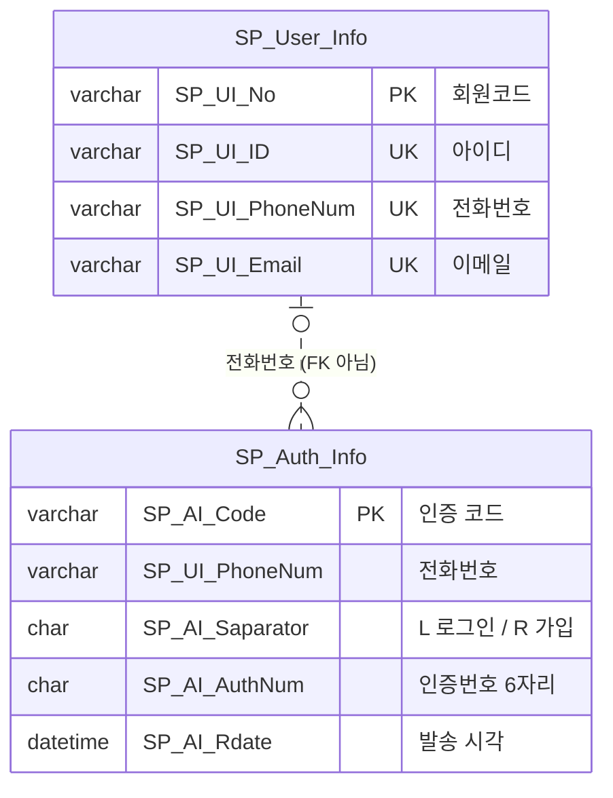

# SHOPPING MALL — 쇼핑몰 웹 서비스

> Spring Boot와 SQL Server로 만든 쇼핑몰 웹 서비스입니다. **아이디 + 전화번호 인증**으로 회원가입·로그인하고, 대·중·소 **3단계 카테고리**로 상품을 찾아 상세 정보를 확인할 수 있습니다.

## 주요 기능

| 기능 | 내용 |
| --- | --- |
| **회원가입** | 이름·아이디·전화번호·생년월일·이메일 입력 → 전화번호 인증번호 확인 후 가입 완료 |
| **로그인** | 아이디 + 전화번호 확인 → 인증번호 입력으로 로그인 (비밀번호 없음) |
| **인증번호 관리** | 6자리 인증번호, 3분 만료, 사용한 번호와 이전 번호는 자동 비활성화 |
| **상품 목록** | 대분류·중분류 버튼으로 필터링, 상위 카테고리를 고르면 하위 카테고리 상품까지 모두 조회 |
| **상품 상세** | 카테고리 경로(대 / 중 / 소), 이미지 갤러리, 가격·재고(품절 표시)·공급처, 상세정보 표 |

> 현재 인증번호는 실제 문자로 발송하지 않고 **화면에 테스트용으로 표시**합니다.

## 기술 스택

| 구분 | 사용 기술 |
| --- | --- |
| Backend | Java 21, Spring Boot 4.1, Spring JDBC (`JdbcTemplate`) |
| Frontend | Thymeleaf, HTML, CSS, Vanilla JS |
| Database | Microsoft SQL Server 2022 Express |
| Build | Gradle |

## 화면 흐름



## DB 설계

### 상품 영역



### 회원 영역

두 테이블은 FK 없이 전화번호 값으로만 연결됩니다.



**설계 포인트**

- **인증 테이블의 전화번호는 FK가 아닙니다.** 회원가입 인증은 회원이 생기기 전에 저장되기 때문입니다.
- **인증 시각은 `datetime`** 으로 저장해 3분 만료를 초 단위로 검사합니다.
- **카테고리 상위코드 저장 규칙**: 대분류는 상위코드 1·2 모두 NULL, 중분류는 상위코드 1만, 소분류는 1·2 모두 입력합니다. 덕분에 대분류 상품 조회가 조인 없이 `SP_CI_TopLayer` 조건 하나로 됩니다.
- **상세정보는 항목명/항목값 행으로 저장**해, 상품 종류마다 다른 정보(소재, 크기, 제조국 등)를 테이블 변경 없이 담습니다.

전체 컬럼과 제약 조건은 [`db/schema.sql`](db/schema.sql)에 있습니다.

## 프로젝트 구조

```
├── db
│   ├── schema.sql          # 테이블 생성 스크립트
│   └── sample_data.sql     # 화면 확인용 샘플 데이터 (카테고리 9, 상품 5)
└── src/main
    ├── java/com/example/demo
    │   ├── controller      # UserController, ProductController, HomeController
    │   ├── service         # UserService, ProductService
    │   ├── repository      # UserRepository, ProductRepository (JdbcTemplate SQL)
    │   └── dto
    └── resources
        ├── application.properties.example   # DB 접속 설정 템플릿
        └── templates                        # index, user/*, product/*
```

## 실행 방법

### 1. DB 준비

SQL Server에 `ShoppingMall_System` 데이터베이스를 만든 뒤, SSMS에서 아래 스크립트를 순서대로 실행합니다.

1. `db/schema.sql`: 테이블 생성
2. `db/sample_data.sql`: 샘플 상품 데이터 (선택)

### 2. 접속 설정

`application.properties.example`을 복사해 `application.properties`를 만들고 DB 주소·계정·비밀번호를 입력합니다.

```bash
cp src/main/resources/application.properties.example src/main/resources/application.properties
```

> `application.properties`는 비밀번호가 들어 있어 `.gitignore`로 제외되어 있습니다.

### 3. 실행

```bash
./gradlew bootRun
```

Windows에서는 `gradlew.bat bootRun`을 실행합니다.

| 페이지 | 주소 |
| --- | --- |
| 메인 | http://localhost:8080 |
| 회원가입 | http://localhost:8080/user/register |
| 로그인 | http://localhost:8080/user/login |
| 상품 목록 | http://localhost:8080/product |
| 상품 상세 | http://localhost:8080/product/{상품코드} |

상품 이미지는 `src/main/resources/static/images/product/`에 DB의 이미지명과 같은 파일명으로 넣으면 표시됩니다. 파일이 없으면 기본 아이콘이 나옵니다.

## 향후 개선 계획

- 문자 발송 API 연동 (현재는 인증번호를 화면에 표시)
- 장바구니 · 주문 · 배송지 기능
- 상품 옵션(색상·사이즈)별 재고 관리
- 관리자 상품 등록과 이미지 업로드
